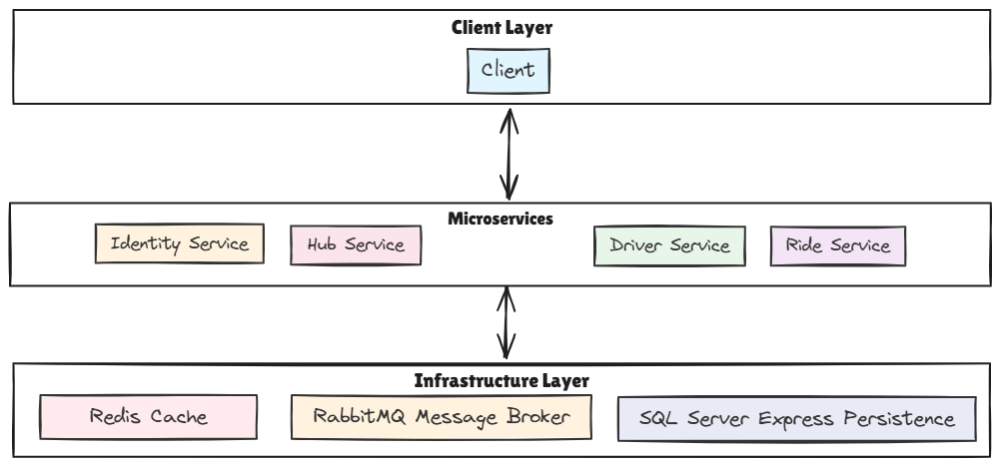

# Project Voyager - Ride-Sharing Backend System

## Architecture Overview

Project Voyager implements a microservices architecture designed for scalability, reliability and real-time features. The system is divided into four main services that handle distinct aspects of the ride-sharing platform:

1. **Identity Service**: Manages user authentication, authorization and profile management
2. **Driver Service**: Handles driver availability, location updates and matching algorithms
3. **Ride Service**: Manages ride lifecycle from request to completion
4. **Hub Service**: Enables real-time communication between riders and drivers

### System Architecture Diagram



## Development Roadmap

The project was developed following this structured approach:

1. **Architecture Design**
   - Microservices identification
   - Infrastructure components selection
   - Communication patterns definition

2. **Entities and Business Logic**
   - Domain model definition
   - Command and Query Responsibility Segregation (CQRS) implementation
   - Service interfaces design

3. **Real-time Events**
   - SignalR hub implementation
   - Location tracking system
   - Real-time notifications

4. **Initial Bugfix and Validation Flow**
   - Authentication flow verification
   - API endpoints validation
   - Basic errors handling

5. **Performance/Security Improvements**
   - Rate limiting implementation
   - Redis caching integration
   - Database indexes optimization
   - Spatial data handling

6. **Testing Implementation**
   - Basic unit tests setup
   - Integration tests setup
   - Testing infrastructure preparation

7. **Global Analysis and Assessment**
   - System review
   - Missing features identification

8. **Demo Project**
   - End-to-end flow implementation
   - Real scenario simulation

9. **Final Review and Bugfix**
   - Last errors handling
   - Code cleanup
   - Performance verification
   - Security checks

10. **Documentation**
    - Code documentation
    - Architecture documentation

## Core Components Implementation

### Ride Requests & Driver Availability

The system handles ride requests and driver availability through these key mechanisms:

1. **Driver Status Management**
   - Real-time tracking of driver status (Available, OnRide, Offline)
   - Geospatial indexing for efficient location queries
   - Redis caching for high-performance status lookups

2. **Location Tracking**
   - Real-time location updates via WebSocket connections
   - Efficient spatial data storage using SQL Server's geography type
   - Location data caching with automatic invalidation

### Matching Algorithm

The driver-rider matching system implements a scoring algorithm that considers multiple factors:

```csharp
score = (distanceWeight * normalizedDistance) + (ratingWeight * (1 - normalizedRating))
```

Key features:
- Geographic proximity prioritization
- Driver rating consideration
- Historical performance factors
- Real-time availability checks
- Cache-optimized implementation

### Ride Tracking

Real-time ride tracking is implemented through:

1. **Location Updates**
   - WebSocket connections for instant location broadcasting
   - Efficient pub/sub system using SignalR
   - Automatic reconnection handling

2. **ETA Calculation**
   - Stimated dynamic traffic pattern consideration

## Technical Considerations

### Scalability
- Microservices architecture enables independent scaling
- Redis caching for high-performance data access
- Efficient database indexing strategies
- Rate limiting implementation for API protection

### Real-time Communication
- SignalR for WebSocket connections
- RabbitMQ for service-to-service communication
- Optimized for minimal latency

### Data Consistency
- Distributed caching with Redis
- Optimistic concurrency control
- Automatic cache invalidation

### Security
- OpenIddict implementation
- Rate limiting protection

## Infrastructure Components

The system utilizes:
- **SQL Server Express**: For persistent data storage with spatial capabilities
- **Redis**: For distributed caching and real-time data
- **RabbitMQ**: For message queuing and event distribution
- **Docker**: For containerization and deployment
- **.NET 9**: For service implementation
- **SignalR**: For WebSocket communication

## Default User Flow

The system is designed around this primary user journey:

1. **Rider Journey**
   - User registers/authenticates
   - Requests a ride with location details
   - Chooses a driver
   - Gets real-time driver location updates
   - Pickups by the driver
   - Receives ride completion notification
   - Rates the driver

2. **Driver Journey**
   - Driver registers/authenticates
   - Sets availability status
   - Provides location updates in real-time
   - Receives ride requests
   - Accepts/ignore rides
   - Arrives to ride requested location
   - Completes rides
   - Receives rider ratings
   - Rates the rider

## Current Limitations and Future Improvements

Several aspects of the system require further development or were implemented at a basic level at the moment.

#### Testing Coverage
- Integration tests are currently non-functional and need fixing
- Unit tests are minimal, serving only as examples
- Need for comprehensive test coverage across all services

#### Payment Processing
- Payment gateway integration
- Fare calculation system
- Payment dispute handling

#### Security Enhancements
- Additional input validation
- Enhanced rate limiting strategies
- Comprehensive security auditing

#### Monitoring and Logging
- Centralized logging system
- Performance monitoring
- Alert system for issues

#### Administration Features
- Admin endpoints based on role
- System configuration tools

#### Service Enhancements
- Multiple vehicle types
- Scheduled rides
- Surge pricing implementation
- Enhanced matching algorithms using the real-time traffic data

## Running Tests

### Unit Tests
You can run unit tests for individual projects using:

```bash
# Run Driver unit tests
dotnet test Driver/Driver.Tests/Driver.Tests.csproj

# Run Ride unit tests
dotnet test Ride/Ride.Tests/Ride.Tests.csproj

# Run all tests in the solution
dotnet test Voyager.sln
```

Note: The solution includes example unit tests for:
- Driver service
  - `AddDriverHandlerTests`
  - `GetDriverStatusHandlerTests`
- Ride service
  - `AcceptRideHandlerTests`
  - `StartRideHandlerTests`
  - `GetActiveRideHandlerTests`

### Integration Tests
The solution includes integration test projects (`*.IntegrationTests`), but they are currently not functional and need fixing. They were set up to demonstrate the testing approach but require additional work to be operational.

The test architecture uses:
- xUnit as the testing framework
- FluentAssertions for assertions
- NSubstitute for mocking
- InMemory database for unit tests
- TestContainers for integration tests

## How to Running the Project

#### Prerequisites

- **Docker**
- **.NET 9 SDK** (only for running the demo project and tests projects)

#### Instructions

1. Start the infrastructure:
```bash
docker-compose up -d
```

2. Access the services:
- Hub API: http://localhost:5000
- Identity API: http://localhost:5001
- Driver API: http://localhost:5002
- Ride API: http://localhost:5003

3. Run the demo:
```bash
dotnet run --project Demo/Demo.csproj
```

4. Stopping and cleaning up (stop all containers, remove containers and volumes, remove locally created images):
```
docker-compose down -v --rmi local
```
